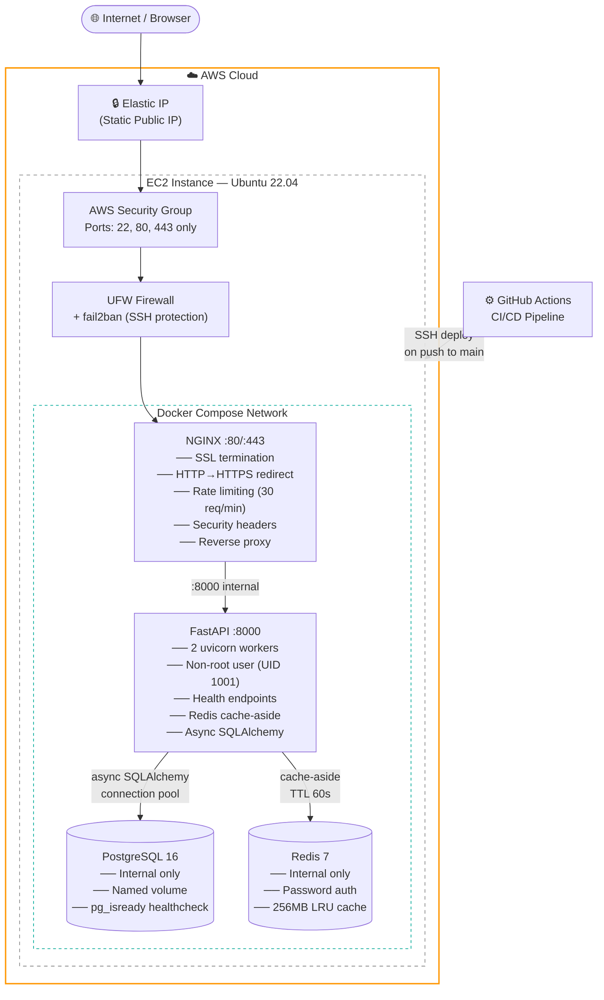

# Architecture Documentation

## Overview

This project deploys a production-ready FastAPI application on AWS EC2 using Docker Compose. The architecture follows a layered approach where each component has a single responsibility and communicates only with the components it needs to.

---

## Architecture Diagram



---

## Component Responsibilities

### NGINX (Reverse Proxy)
- **Port exposure** — Only component that listens on public ports (80, 443)
- **SSL termination** — Handles HTTPS so FastAPI doesn't have to
- **HTTP → HTTPS redirect** — Forces all traffic to encrypted connection
- **Rate limiting** — 30 requests/minute per IP, blocks abuse before it reaches the app
- **Security headers** — HSTS, X-Frame-Options, X-Content-Type-Options, etc.
- **Upstream proxy** — Forwards clean requests to FastAPI on internal port 8000

### FastAPI (Application Layer)
- **API endpoints** — RESTful CRUD operations under `/api/v1/`
- **Health checks** — `/health`, `/health/live`, `/health/ready` for monitoring
- **Request logging** — Every request logged with method, path, status, duration
- **Cache-aside** — Reads from Redis first, falls back to PostgreSQL on miss
- **Connection pooling** — 10 permanent DB connections, up to 30 under load
- **Async throughout** — Non-blocking I/O for all DB and cache operations

### PostgreSQL (Primary Database)
- **Persistent storage** — All application data stored here
- **Named volume** — Data survives container restarts and rebuilds
- **Internal only** — No host port mapping, unreachable from outside Docker
- **Health checked** — `pg_isready` probe before API is allowed to start

### Redis (Cache Layer)
- **Cache-aside pattern** — Stores frequently read items with 60s TTL
- **Cache invalidation** — Write operations (POST/PATCH/DELETE) clear affected cache keys
- **Memory limit** — 256MB max with LRU eviction (least recently used items dropped first)
- **Internal only** — Password protected, no host port mapping

---

## Network Architecture

```
┌─────────────────────────────────────────────────────────┐
│                    Docker Network (bridge)               │
│                                                         │
│   ┌─────────┐    ┌──────────┐    ┌───────────────────┐  │
│   │  NGINX  │───▶│ FastAPI  │───▶│   PostgreSQL :5432│  │
│   │:80/:443 │    │  :8000   │    └───────────────────┘  │
│   └─────────┘    │          │                           │
│        ▲         │          │───▶┌───────────────────┐  │
│        │         └──────────┘    │    Redis :6379    │  │
│   (only port                     └───────────────────┘  │
│  exposed to                                             │
│    host)                                                │
└─────────────────────────────────────────────────────────┘
```

Only NGINX has `ports:` mapping in docker-compose.yml.
PostgreSQL and Redis use `expose:` — reachable only inside Docker network.

---

## Request Lifecycle

```
1. Browser sends GET https://yoursite.com/api/v1/items/42

2. NGINX receives on :443
   ├── Validates SSL certificate
   ├── Checks rate limit (30 req/min per IP)
   ├── Adds security headers
   └── Proxies to FastAPI :8000

3. FastAPI receives request
   ├── Middleware logs: "GET /api/v1/items/42 → ..."
   ├── Checks Redis for key "items:42"
   │   ├── HIT  → returns cached JSON immediately
   │   └── MISS → queries PostgreSQL
   │              stores result in Redis (TTL 60s)
   │              returns JSON
   └── Response flows back through NGINX to browser

Total time: ~5-15ms (cache hit) or ~20-50ms (cache miss)
```

---

## CI/CD Pipeline

```
Developer pushes to main branch
           │
           ▼
    GitHub Actions triggered
           │
    ┌──────┴──────┐
    │  Job 1: Test │
    │  ─────────── │
    │  • Checkout  │
    │  • pip install│
    │  • pytest    │
    │  • docker    │
    │    build     │
    └──────┬───────┘
           │ (only if tests pass)
           ▼
    ┌──────────────────┐
    │  Job 2: Deploy   │
    │  ──────────────  │
    │  • SSH to EC2    │
    │  • git pull      │
    │  • write .env    │
    │  • docker build  │
    │  • docker up     │
    │  • health check  │
    │  • nginx reload  │
    │  • image prune   │
    └──────────────────┘
           │
           ▼
    ✅ Deployment complete
```

---

## Security Layers

| Layer | Mechanism | Protects Against |
|---|---|---|
| AWS Security Group | Allow 22/80/443 only | Port scanning, direct DB access |
| UFW Firewall | Same rules enforced at OS level | Defence in depth |
| fail2ban | Bans IPs after 5 failed SSH attempts | SSH brute force |
| SSH hardening | Root login disabled, password auth off | Unauthorised server access |
| NGINX rate limiting | 30 req/min per IP | API abuse, DDoS |
| NGINX security headers | HSTS, X-Frame-Options, etc. | XSS, clickjacking |
| TLS 1.2/1.3 only | Strong cipher suite | Downgrade attacks |
| Non-root Docker user | UID 1001 (appuser) | Container escape privilege escalation |
| No host port on DB/Redis | `expose:` not `ports:` | Direct DB access from internet |
| Secrets via env vars | `.env` never committed | Credential leaks in git history |
| Soft deletes | `is_active=False` not DELETE | Accidental data loss |

---

## Data Flow Diagram

```
Write path (POST/PATCH/DELETE):
  Request → FastAPI → PostgreSQL (write)
                    → Redis (invalidate cache key)

Read path (GET):
  Request → FastAPI → Redis? ──HIT──▶ Response
                           │
                         MISS
                           │
                           ▼
                       PostgreSQL
                           │
                           ▼
                    Store in Redis (60s TTL)
                           │
                           ▼
                        Response
```

---

## Backup & Recovery

```
Daily at 2 AM (cron):
  pg_dump → gzip → ~/backups/postgres/backup_YYYYMMDD.sql.gz
                 → (optional) S3 bucket upload
                 → delete backups older than 7 days

Recovery:
  gunzip backup.sql.gz | docker exec -i devops_postgres psql -U appuser appdb
```

---

## Scaling Considerations

This setup is designed for a single server. To scale further:

| Current | Production Scale Equivalent |
|---|---|
| PostgreSQL in Docker | AWS RDS (managed, multi-AZ, auto-backups) |
| Redis in Docker | AWS ElastiCache (managed, cluster mode) |
| Single EC2 | Auto Scaling Group behind an Application Load Balancer |
| Self-signed SSL | AWS Certificate Manager + ALB |
| Manual image tags | ECR (Elastic Container Registry) with commit SHA tags |
| Single server deploy | Blue-green deployment or ECS/EKS |
| pg_dump cron | RDS automated snapshots + point-in-time recovery |

---

## Technology Versions

| Component | Version | Notes |
|---|---|---|
| Python | 3.12 | Slim Docker image |
| FastAPI | 0.115.5 | Latest stable |
| SQLAlchemy | 2.0.36 | Async engine |
| asyncpg | 0.30.0 | Async PostgreSQL driver |
| Redis client | 5.2.0 | Async support |
| PostgreSQL | 16 (Alpine) | Latest stable, minimal image |
| Redis | 7 (Alpine) | Latest stable, minimal image |
| NGINX | 1.27 (Alpine) | Latest stable, minimal image |
| Docker Compose | v2 | Plugin (not standalone) |
